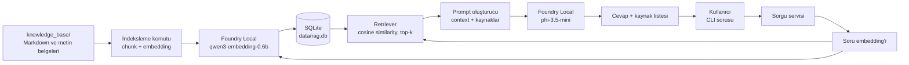

# Local RAG Assistant - Teknik Mimari ve Uygulama Sözleşmesi

> Durum: Başlangıç mimarisi (MVP). Bu belge, kod yazılırken kararların
> kaynağıdır. İlk hedef küçük bir belge koleksiyonunda tamamen yerel ve
> izlenebilir soru-cevap uygulamasını güvenilir biçimde çalıştırmaktır.

## 1. Amaç ve kapsam

Uygulama, `knowledge_base/` klasöründeki kullanıcı belgelerini indeksler.
Kullanıcı terminalden bir soru yazdığında uygulama önce ilgili belge
parçalarını bulur, sonra yalnızca bu parçaları bağlam olarak yerel dil modeline
gönderir. Cevap ile birlikte kullanılan kaynaklar gösterilir.

MVP kapsamı:

- Tek bilgisayar, tek kullanıcı ve terminal (CLI) arayüzü.
- İnternet olmadan soru-cevap çalıştırma. İlk SDK/model indirmesi için internet
  gerekir; model önbelleğe alındıktan sonra sorgu akışında ağ çağrısı yapılmaz.
- UTF-8 kodlu `.txt` ve `.md` belgeleri.
- SQLite dosyasında kalıcı indeks; vektör araması Python içinde cosine
  similarity ile yapılır.
- Kaynak gösterme, boş sorgu kontrolü ve belirsiz bilgi için güvenli geri dönüş.

Kapsam dışı (ilk sürüm): PDF/DOCX okuyucu, web arayüzü, kullanıcı hesabı,
çoklu kullanıcı, belgeyi otomatik izleme, bulut/veritabanı sunucusu ve büyük
ölçekli vektör veritabanı.

## 2. Kesin teknoloji seçimleri

| Alan | Seçim | Gerekçe |
|---|---|---|
| Dil | Python 3.11+ | Başlangıç için sade, `sqlite3` standart kütüphanede. |
| Yerel AI çalışma zamanı | Microsoft Foundry Local | Yerel model katalogu ve Python SDK sağlar. |
| Windows SDK paketi | `foundry-local-sdk-winml` | Windows ML donanım hızlandırmasını kullanır. |
| Embedding modeli | `qwen3-embedding-0.6b` | Microsoft'un güncel Foundry Local RAG örneğinde kullanılan model takma adı. |
| Sohbet modeli | `phi-3.5-mini` | CPU varyantı bu makinede indirildi ve doğrulandı. |
| Kalıcı depolama | SQLite (`data/rag.db`) | Sunucusuz, taşınabilir, offline ve küçük koleksiyon için yeterli. |
| Vektör biçimi | JSON metni | Ek bağımlılık olmadan denetlenebilir ve güvenli biçimde saklanır. |
| Benzerlik | Cosine similarity | Aynı embedding modeliyle üretilmiş vektörler için uygun başlangıç yaklaşımı. |
| Arayüz | CLI | Önce RAG doğruluğunu kanıtlar; UI daha sonra eklenir. |

Bu model adları katalogdaki *alias* değerleridir. Kod ilk çalıştırmada
`get_model(...)` sonucunun boş olmadığını kontrol etmeli; katalogda alias
bulunamazsa kullanıcıya `foundry model list` ile kullanılabilir adları
göstermelidir. Modeli elle başka bir ada değiştirmek ancak bu kontrolün ardından
yapılabilir.

## 3. Sistem görünümü



İki ayrı çalışma modu vardır:

1. **İndeksleme:** Belgeleri okur, parçalar, embedding üretir ve SQLite'a
   yazar. `python -m app ingest` ile elle başlatılır.
2. **Sorgulama:** Mevcut indeksi yalnızca okur; yeni belgeyi otomatik indekslemez.
   `python -m app chat` ile başlatılır.

Bu ayrım sorgu sırasında gereksiz embedding üretimini, yavaşlığı ve veri
tutarsızlığını önler.

## 4. Klasör ve modül yapısı

```text
Summer-School-Foundry-Local/
├── ARCHITECTURE.md              # Bu belge
├── README.md                    # Kurulum ve kısa kullanım rehberi
├── requirements.txt             # Tekrar üretilebilir Python bağımlılıkları
├── knowledge_base/              # Kullanıcının kaynak .md/.txt belgeleri
│   └── .gitkeep
├── data/                        # Çalışma verisi; Git'e eklenmez
│   └── .gitkeep
├── app/
│   ├── __init__.py
│   ├── __main__.py              # ingest/chat komutlarını yönlendirir
│   ├── config.py                # Tüm sabitler ve yollar
│   ├── foundry.py               # SDK/model yaşam döngüsü
│   ├── document_loader.py       # UTF-8 .md/.txt bulma ve okuma
│   ├── chunker.py               # Deterministik metin parçalama
│   ├── repository.py            # SQLite şeması ve CRUD
│   ├── ingest.py                # İndeksleme orkestrasyonu
│   ├── retrieval.py             # cosine similarity ve eşik kontrolü
│   ├── prompting.py             # Sistem promptu ve context biçimi
│   └── chat.py                  # CLI soru-cevap döngüsü
└── tests/
    ├── test_chunker.py
    ├── test_repository.py
    ├── test_retrieval.py
    └── fixtures/
```

`data/rag.db`, sanal ortam klasörü, Python önbellekleri ve indirilen modeller
Git'e eklenmez. `knowledge_base/` içeriği proje verisi sayılır; telif veya özel
veri içeriyorsa ayrıca `.gitignore` ile dışarıda tutulur.

## 5. Veri sözleşmesi ve SQLite şeması

Embedding vektörü JSON dizisi olarak saklanır. Uygulama JSON'u yalnızca
`json.loads` ile okur; `eval` veya benzeri kod çalıştıran yöntemler kesinlikle
kullanılmaz.

```sql
PRAGMA foreign_keys = ON;

CREATE TABLE IF NOT EXISTS documents (
    id            INTEGER PRIMARY KEY,
    source_path   TEXT NOT NULL UNIQUE,
    content_hash  TEXT NOT NULL,
    indexed_at    TEXT NOT NULL
);

CREATE TABLE IF NOT EXISTS chunks (
    id               INTEGER PRIMARY KEY,
    document_id      INTEGER NOT NULL REFERENCES documents(id) ON DELETE CASCADE,
    chunk_index      INTEGER NOT NULL,
    content          TEXT NOT NULL,
    embedding_json   TEXT NOT NULL,
    embedding_model  TEXT NOT NULL,
    created_at       TEXT NOT NULL,
    UNIQUE(document_id, chunk_index)
);

CREATE INDEX IF NOT EXISTS idx_chunks_document_id ON chunks(document_id);
```

Kurallar:

- `source_path`, proje köküne göre normalize edilmiş `/` ayraçlı göreli yoldur.
- `content_hash`, belgenin UTF-8 içeriğinin SHA-256 özetidir.
- Aynı dosya ve aynı hash yeniden indekslenmez; değişmiş dosyanın eski
  parçaları işlem içinde silinip yenileri eklenir.
- Bir indeksleme çalışması yalnızca başarılı embedding üretiminden sonra
  `commit` eder. Hata halinde `rollback` yapılır; yarım indeks bırakılmaz.
- Sorgu zamanı, `embedding_model` değerinin beklenen model alias'ı ile aynı
  olduğunu doğrular. Farklıysa yeniden indeksleme istenir.

## 6. İndeksleme akışı

1. `knowledge_base/` altında yalnızca `.md` ve `.txt` dosyalarını, alfabetik
   ve tekrar üretilebilir sırayla bul.
2. Her dosyayı UTF-8 olarak oku; boş veya yalnızca boşluk içeren dosyayı uyarı
   vererek atla. Kodlama hatası kullanıcıya dosya adıyla bildirilir.
3. Metni normalize et: satır sonlarını `\n` yap, baş/son boşlukları kaldır;
   içeriği değiştirecek agresif temizleme yapma.
4. Önce paragraf sınırlarında, gerekirse cümle sınırlarında böl. Hedef parça
   boyutu **800 karakter**, overlap **120 karakter** olsun. Hiçbir boş parça
   üretilmez; her parça kaynak dosya ve sıra numarasıyla ilişkilidir.
5. Parçaların embedding'lerini Foundry Local'ın batch API'si ile üret.
6. Dosya için SQLite yazımını bir transaction içinde yap: değişmiş eski
   parçaları sil, belge kaydını güncelle, yeni parçaları ekle, commit et.
7. Sonunda işlenen/atlanan dosya ve oluşturulan parça sayısını yazdır.

İndeksleme tamamlanmadan chat başlatılmaz. Hiç parça yoksa uygulama net bir
mesajla `ingest` komutunun çalıştırılmasını ister.

## 7. Sorgu ve cevap akışı

1. Kullanıcı sorusunu `strip()` ile temizle. Boş soru model çağrısı yapmadan
   reddedilir; `quit` ve `exit` uygulamadan güvenli çıkış komutlarıdır.
2. Sorunun embedding'ini indekslemede kullanılan aynı embedding modeliyle üret.
3. SQLite'dan parça metni, embedding JSON'u ve kaynak yolunu getir.
4. Her parçanın cosine similarity değerini hesapla, azalan sırala ve en fazla
   **3** parça seç.
5. En iyi skor **0.35** değerinin altındaysa LLM çağrısı yapma; şu anlamdaki
   sabit yanıtı ver: “Bu bilgi yerel bilgi tabanında bulunmuyor.” Bu değer ilk
   testlerden sonra kayıtlı test setiyle ayarlanabilir.
6. Seçilen parçaları, kaynak adı ve skoruyla birlikte sistem mesajına koy.
7. Chat modeline biri `system`, biri `user` olmak üzere iki mesaj gönder; ilk
   sürümde geçmiş konuşma ekleme.
8. Yanıtı token token yazdır. Ardından uygulamanın kendi ürettiği kaynak
   listesi gösterilir. Kaynaklar modelin ürettiği metinden ayrıdır; modelin
   sahte kaynak yazması böylece engellenir.

### Sistem promptu

Kodda tek bir sabit olarak bulunacak sistem mesajı:

```text
Sen yerel belge asistanısın. Yalnızca aşağıdaki BAĞLAM içinde bulunan bilgiye
dayanarak Türkçe cevap ver. Bağlam soruyu cevaplamak için yeterli değilse tam
olarak “Bu bilgi yerel bilgi tabanında bulunmuyor.” de. Bağlamda olmayan
ayrıntıları tahmin etme, uydurma ve kaynak adı üretme. Cevabın kısa ve açık
olsun.

BAĞLAM:
{context}
```

`context`, şu formatta ve en fazla üç parçadan oluşur:

```text
[Kaynak: knowledge_base/ornek.md | Parça: 2 | Skor: 0.71]
... parça metni ...
```

## 8. Model yaşam döngüsü ve hata yönetimi

- Foundry Local yöneticisi ilk embedding veya sohbet isteğinde yalnızca bir kez
  başlatılır; hiçbir belge değişmemişse indeksleme model başlatmaz.
- Windows'ta önce execution provider'lar indirilir/kaydedilir; bu işlem SDK'nın
  kendi metoduyla yapılır. Modelin ilk indirilmesi uzun sürebilir; ilerleme
  terminale yazdırılır.
- Her model için uygulama başlangıcında `model.download()` çağrılır, ardından
  `model.load()` çağrılır. SDK, model zaten tam olarak önbellekteyse indirme
  işlemini tekrar etmez; bu çağrı eksik/bozulmuş model önbelleğinin kullanılması
  riskini azaltır. Embedding modeli ve chat modeli işlem boyunca bir kez
  yüklenir, tekrar tekrar yüklenmez.
- `try/finally` içinde tüm yüklenen modeller `unload()` edilir.
- Model alias'ı bulunamaz, model indirilemez veya SDK başlatılamazsa traceback
  yerine anlaşılır mesaj ve sonraki adım verilir; program sıfırdan farklı bir
  çıkış koduyla biter.
- SQLite bağlantısı context manager ile kapatılır; yazma hatası transaction
  rollback'i yapar.
- Beklenmeyen LLM yanıtında boş `choices` veya boş içerik kontrol edilir; boş
  cevap kullanıcıya bildirilir.

## 9. Kurulum ve çalıştırma sözleşmesi

Geliştirme öncesi doğrulanacaklar:

```powershell
py -3.11 --version
winget install Microsoft.FoundryLocal
py -3.11 -m venv .venv
.\.venv\Scripts\Activate.ps1
python -m pip install --upgrade pip
pip install foundry-local-sdk-winml openai
```

`requirements.txt`, kod yazılmaya başlandığında bu ortamda çalışan sürümlerin
`pip freeze` çıktısından bilinçli biçimde oluşturulacak; sürüm numaraları
tahmin edilerek bu belgede sabitlenmeyecektir. Python'ın `sqlite3` modülü
standart kütüphanededir ve ayrıca kurulmaz.

İlk kod sürümünün komut arayüzü:

```powershell
python -m app ingest
python -m app chat
python -m unittest discover -s tests -v
```

## 10. Kabul testleri

Kod “tamamlandı” sayılmadan önce aşağıdaki kontrollerin her biri geçmelidir.

| ID | Senaryo | Beklenen sonuç |
|---|---|---|
| AT-01 | Üç küçük UTF-8 belge indekslenir | `rag.db` oluşur; parça sayısı sıfırdan büyüktür. |
| AT-02 | Aynı belgelerde ingest tekrar çalışır | Çift parça oluşmaz. |
| AT-03 | Bir belge değiştirilir ve ingest çalışır | Yalnızca o belgenin parçaları güncellenir. |
| AT-04 | Belgede açıkça bulunan soru sorulur | İlgili kaynak, ilk üç sonuç arasında gösterilir. |
| AT-05 | Belgelerde olmayan soru sorulur | Sabit “bulunmuyor” yanıtı verilir; LLM çağrısı yapılmaz. |
| AT-06 | Boş soru sorulur | Hata vermeden kullanıcıdan yeniden soru istenir. |
| AT-07 | `quit` yazılır | Model(ler) unload edilerek süreç temiz biter. |
| AT-08 | SQLite'a bozuk embedding JSON'u yerleştirilir | Uygulama dosya/kayıt kimliğiyle anlaşılır hata verir; kod çalıştırmaz. |
| AT-09 | Ağ bağlantısı ilk indirmeden sonra kesilir | Önceden indirilmiş modeller ve mevcut indeksle chat çalışır. |
| AT-10 | Birim testleri çalıştırılır | Chunking, cosine similarity, repository transaction davranışları geçer. |

## 11. Bilinçli sonraki adımlar

MVP kabul testleri geçtikten sonra, bu sırayla ilerlenir:

1. PDF/DOCX için ayrı ve test edilmiş metin çıkarıcı eklemek.
2. FastAPI ve Next.js ile aynı `chat` servis katmanını kullanan web arayüzünü geliştirmek.
3. İndeksleme geçmişi ve daha ayrıntılı kaynak paneli eklemek.
4. Veri hacmi veya çoklu kullanıcı ihtiyacı gerçekten oluşursa SQLite'tan
   PostgreSQL/pgvector (ör. Supabase) seçeneğine geçmek.

Bu sırada `repository.py` dışındaki modüller doğrudan SQLite SQL'i yazmamalıdır;
böylece depolama katmanı ileride değiştirilebilir.

## 12. Resmi referanslar

- [Microsoft Foundry Local RAG öğreticisi](https://learn.microsoft.com/en-us/azure/foundry-local/tutorials/tutorial-build-rag-app)
- [Python ile Foundry Local başlangıç rehberi](https://learn.microsoft.com/en-us/azure/foundry-local/get-started)
- [Foundry Local ile embedding üretimi](https://learn.microsoft.com/en-us/azure/foundry-local/how-to/how-to-generate-embeddings)
- [Projenin dayandığı Microsoft Community yerel RAG örneği](https://techcommunity.microsoft.com/blog/azuredevcommunityblog/building-your-first-local-rag-application-with-foundry-local/4501968)
